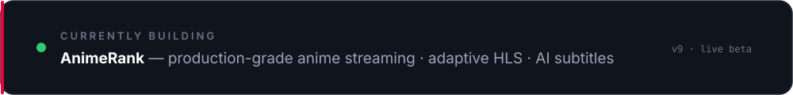
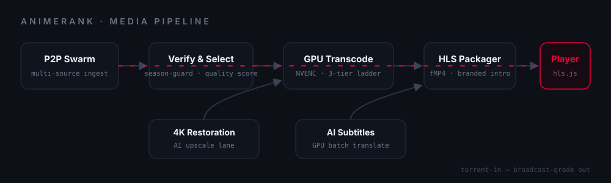
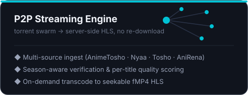
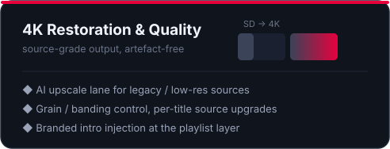
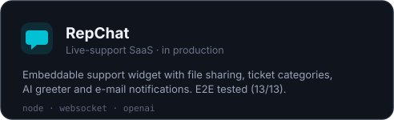
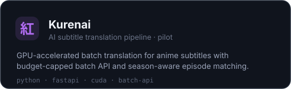
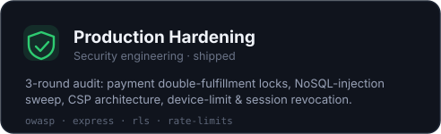

 

## 🎬 AnimeRank — Streaming Engineering

A production-grade anime streaming platform built end to end — from a **peer-to-peer ingest swarm** to a **server-side adaptive HLS pipeline** with **GPU transcoding**, **4K restoration** and **AI-assisted subtitles**.

  

 

 

## 🧩 More Projects

 

 

## 🛠 Stack

+ ffmpeg · NVENC · hls.js · WebTorrent · CUDA · OWASP

 

## 📊 Activity

  

 

ship fast · measure honestly · polish relentlessly

