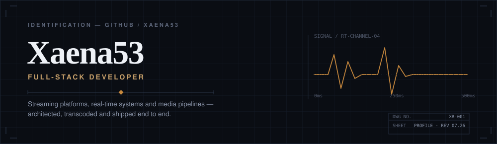
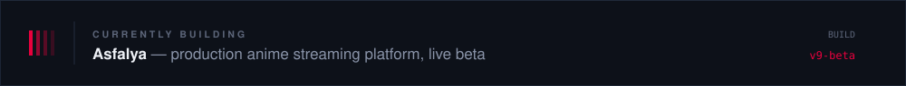
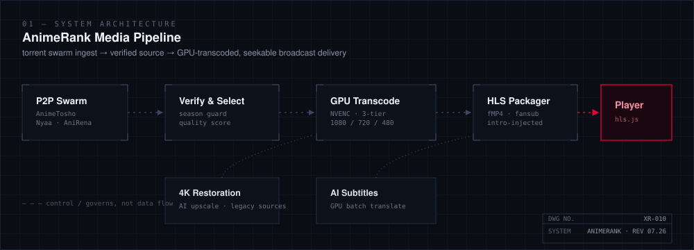
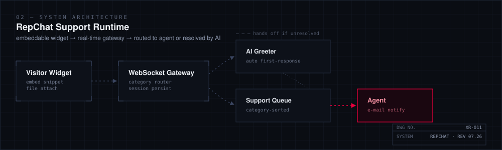
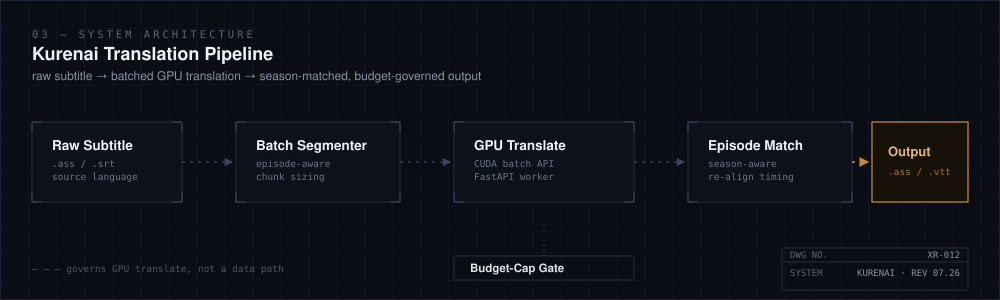
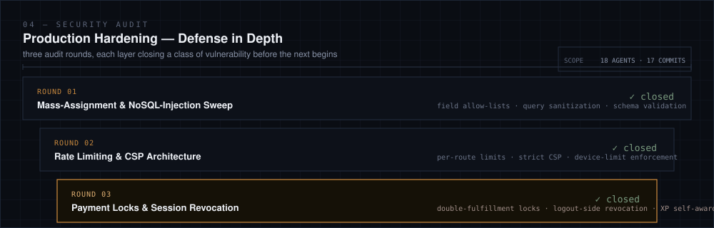
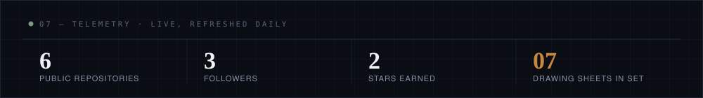

 

A production anime streaming platform built end to end — peer-to-peer ingest, GPU-accelerated adaptive HLS, 4K restoration for legacy sources, and an AI-assisted subtitle pipeline sitting alongside a 21,000+ title catalog.

 

A live-support runtime running in production — embeddable widget, WebSocket gateway, category-routed queues, and an AI greeter that resolves the easy tickets before a human ever sees them.

 

A GPU-batched translation pipeline for anime subtitles — season-aware episode matching and a budget-cap gate that governs spend without touching correctness.

 

 

 

 

 

<code>DWG SET XR-001 — XR-020 · REV 2026.07</code>

