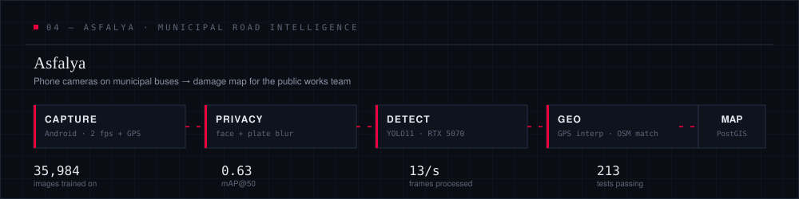
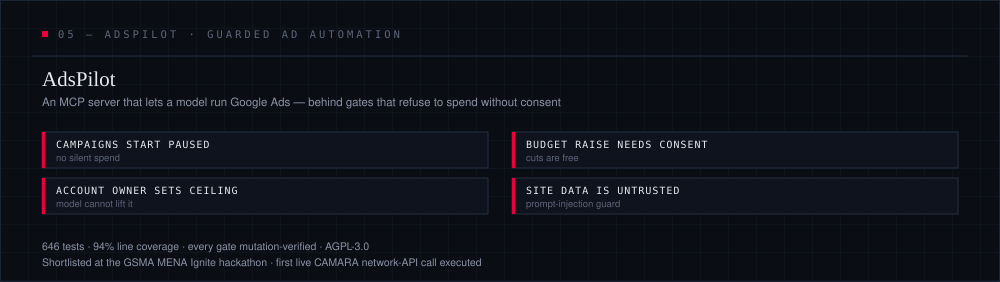
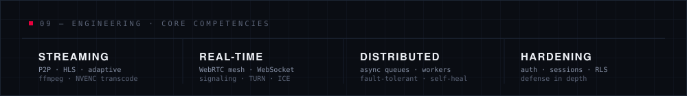
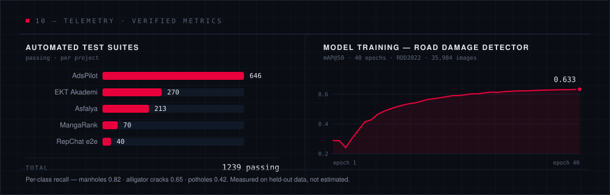
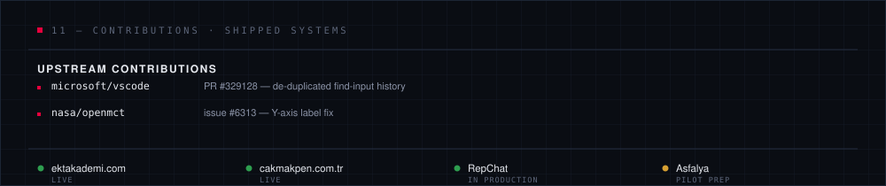
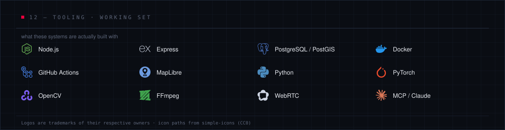

 

A production anime streaming platform built end to end — peer-to-peer ingest, GPU-accelerated adaptive HLS, 4K restoration for legacy sources, and an AI-assisted subtitle pipeline sitting alongside a 21,000+ title catalog.

 

A live-support runtime running in production — embeddable widget, WebSocket gateway, category-routed queues, and an AI greeter that resolves the easy tickets before a human ever sees them.

 

A GPU-batched translation pipeline for anime subtitles — season-aware episode matching and a budget-cap gate that governs spend without touching correctness.

 

Computer vision for municipal road maintenance. Phone cameras ride on city buses; a YOLO11 detector trained on 35,984 images finds potholes, cracks and sunken manholes; GPS interpolation and OSM map-matching pin each one to a street, and duplicate sightings across passes collapse into a single tracked repair. Faces and plates are blurred **before** detection — the pipeline refuses to process an unmasked frame at all, so the privacy rule cannot be forgotten. Node/Express + PostGIS behind a MapLibre panel, with weekly PDF reports for the public works desk.

 

An MCP server that hands Google Ads to a language model without handing it your budget. Campaigns are created paused, budget increases require explicit human consent while cuts go through freely, the account owner sets a ceiling the model cannot raise, and scraped site copy is treated as untrusted input rather than instructions. Shortlisted at the GSMA MENA Ignite hackathon.

 

 

 

 

 

Numbers on this page are measured, not estimated: test counts come from the suites that gate every push, and the training curve is the actual run that produced the road-damage model — including the class it is still weak at.

 

 

 

<a href="mailto:bedometom@gmail.com">bedometom@gmail.com</a>

 

<code>DWG SET XR-001 — XR-025 · REV 2026.08</code>

